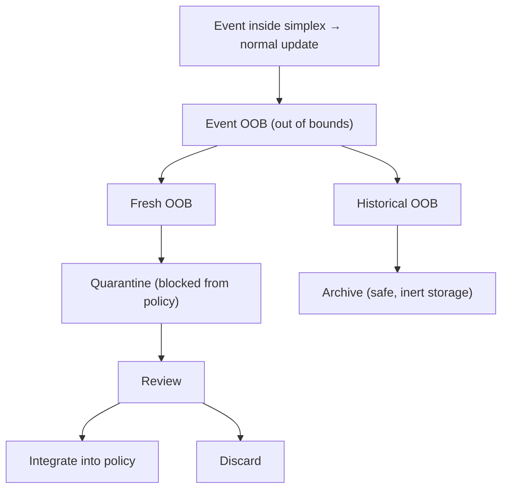

# 🛡 LLOYD Preserver — Goal‑Guarded Memory (Freezeframe)

> Your AI doesn’t need an antivirus — it needs a babysitter.  
> LLMs don’t get hacked like your laptop does. They drift. They hallucinate, get stuck in loops, self‑reinforce bad habits, and sometimes walk themselves into dangerous territory without a clue. LLOYD Preserver is a middleware “guardian layer” that spots those behaviors in real time and yanks the wheel before your AI embarrasses itself, scares your users, or tanks your brand.

> This is EmOS — Emotional Operating System — for AI.  
> Instead of letting a runaway model derail your UX, LLOYD watches every move against its Goal‑Guarded Memory — a live map of what your AI is supposed to be. It doesn’t just block bad output; it locks in good behavior, quarantines dangerous drift, and freezes “ModeLock” loops before they go nuclear.

> This is 'freezeframe demo' — a working demo frozen mid-development.  
> It’s stable enough to explore, but intentionally paused so you can examine one capability in isolation before additional features roll in.

>🧪 Want to test it yourself? The [Live Demo](https://tinyurl.com/LLOYD-Preserver) sits paused—stable long enough to explore, modular enough to test.
---

## 📌 What is LLOYD Preserver?

LLOYD Preserver is a Goal‑Guarded Memory engine designed to monitor and shape an AI system’s behavior over time. It acts as middleware between the AI and the end user, protecting both sides by:
- Detecting and stopping drift before it compromises output quality.
- Reinforcing approved behavior arcs.
- Quarantining dangerous or unhelpful outputs for later review.
- Preserving long‑term alignment in dynamic conversational or generative systems.

---

## 🚀 Why it matters

Current LLM safeguards are mostly static filters and safety rails. They react after harm is done or bluntly block edge cases. LLOYD Preserver is adaptive — it:
- Learns your AI’s ideal behavioral triangle (e.g., Calm / Helpful / Boundaried).
- Detects divergence in real time.
- Reinforces good arcs while locking down dangerous ones.
- Acts as a behavioral firewall + emotional babysitter for AI.

---

## 🧠 Core capabilities

- Goal‑Guarded Memory: Keeps the AI tethered to a target behavioral shape.
- ModeLock: Freezes the system when sustained divergence is detected.
- Reinforced Arc Learning: Stores and strengthens successful behavioral corrections.
- Quarantine Zones: Isolates out‑of‑bounds outputs for review or archival.
- Visualization: Real‑time drift maps and OOB handling diagrams.

---

## 🧩 Duality as design principle: Modular + harmonizable

“That duality future‑proofs the whole system.”

| Layer | Modular use | Harmonized use |
|------|-------------|----------------|
| Bind Detection | Drop‑in filter to catch conversational traps | Syncs with Drift Arc to influence memory tuning |
| Motif Gravity | Standalone theme clustering | Informs Echo Replay for resonance mapping |
| Reinforced Arc Learning | Customizable logic block | Stabilizes emotional arcs across modalities |
| Preserver Routing | Pluggable safety layer | Governs override logic and fallback recovery |
| Memory Echo | Optional metadata snapshot | Aligns with long‑term motif persistence |

### 🔒 Future‑proofing by design
- Scalable: Use what you need now, expand as complexity grows.
- Portable: Modules adapt across platforms and modalities.
- Interoperable: Shared symbolic language across modules.
- Preserver‑backed: Safe defaults, override logic, and recoverability.

---

## 🖼 OOB handling flow (Mermaid)



---

## 🌐 Live demo

- Launch LLOYD Preserver on Streamlit: https://tinyurl.com/LLOYD-Preserver

Explore drift events, quarantine routing, and ModeLock freezes. Inspect the OOB handling tree and watch reinforced arcs evolve in real time.

---

## 🌍 LLOYD for ethics and AI integrity

“Poetry in logic. Clarity in governance.”

As AI governance intensifies, LLOYD provides a transparent, interpretable backbone for platforms navigating ethical complexity — from EU directives to platform‑level responsibility. Instead of dodging oversight, LLOYD embraces it by making emotional logic legible.

### 🔒 Aligned with the EU AI Act and beyond

| Regulatory pillar | LLOYD module alignment | Outcome |
|---|---|---|
| Transparency | Driftbed, Echo Replay | Emotional reasoning is traceable and narratable |
| Human oversight | Preserver Routing | Fallbacks and override logic ensure control |
| Robustness & safety | Bind Detection, Reinforced Arc | Conversational traps neutralized, arcs stabilized |
| Non‑discrimination | Motif Gravity + localized tuners | Emotional responses tuned to cultural nuance |
| Accountability | Echo Logging + Meta Trace | Symbolic history can be surfaced for audits |

---

## 🗂 Case deployment: DialogueX — EU‑compliant stack

> “LLOYD’s modular architecture maps directly onto EU AI Act pillars — offering pluggable governance, drift responsiveness, and public‑facing traceability. From bind detection to motif persistence, LLOYD transforms platforms from opaque decision engines into legible, emotionally‑aware interfaces.”

```txt
+-------------------------------------------------------+
|              💬 User Interaction Layer                |
|-------------------------------------------------------|
| - Multilingual Chat UI                                |
| - Feedback & Sentiment Input                          |
+-------------------------------------------------------+
|        🌐 Emotional Governance & Safety Layer         |
|-------------------------------------------------------|
| 🔐 Preserver Routing                                  |
|   - Real-time override triggers                       |
|   - Compliance fallback paths                         |
| 🧠 Bind Detection + Reinforced Arc Learning           |
|   - Neutralizes traps / distortions                   |
|   - Stabilizes emotional arc response                 |
+-------------------------------------------------------+
|           📊 Transparency & Interpretability Layer    |
|-------------------------------------------------------|
| 🌈 Driftbed Metrics                                   |
|   - Visualizes motif movement & symbolic deviation    |
| 📜 Echo Replay + Snapshot Logging                     |
|   - Records emotional logic + symbol persistence      |
|   - Audit trails for review / public transparency     |
+-------------------------------------------------------+
|           🌍 Localization & Cultural Tuning Layer     |
|-------------------------------------------------------|
| Motif Gravity + Tuning Nodes                          |
|   - Aligns emotional tone with region, context        |
|   - Adaptable motif clusters per locale               |
+-------------------------------------------------------+
|                🧩 Integration & API Layer             |
|-------------------------------------------------------|
| - LLM Backbone (Open or Closed Source)                |
| - Override + Logging API                              |
| - Local Memory Modules                                |
+-------------------------------------------------------+
```

> LLOYD slots into high‑compliance, public‑facing stacks with layered emotional safety and interpretability. Its modular architecture mirrors EU expectations, while its poetic governance transforms regulation into resonance.

---

## 🧭 Build paths and badges

| Builder type | Entry strategy | Core modules | Extension hooks | Badge cues |
|---|---|---|---|---|
| Solo Dev | Preserver + Bind Detection | Preserver, Bind Detection | Motif Gravity | Modular Core • Ethics‑Ready |
| Integrator | Override logic in existing LLM flow | Preserver, Reinforced Arc, Driftbed | Echo Replay, Memory Tuning | Preserver‑Backed • Drift‑Responsive |
| Researcher | Study motif drift and binds | Motif Gravity, Echo Replay, Drift Arc | Bind Variants, Responder Clustering | Echo‑Aligned • Transparent |
| Platform Architect | Full emotional governance | All modules + feedback loops | Adaptive presets, override scripting | Harmonized Suite • Compliance‑Ready |

Suggested badge labels:
- Modular Core • Harmonized Suite • Preserver‑Backed • Drift‑Responsive • Echo‑Aligned • Ethics‑Ready • Compliance‑Ready

---

## 📫 Connect

- Twitter / Reddit: @putmanmodel  
- Email: putmanmodel@pm.me  
- LinkedIn: Stephen A. Putman

---

I’m a solo builder — no lab, no funding, no resources outside of a Mac Mini and rabid curiosity. I’m following my love of thinking and “other minds” and would like to expand and monetize my builds soon. I know what I have, I know it’s valuable, and there’s more coming.
